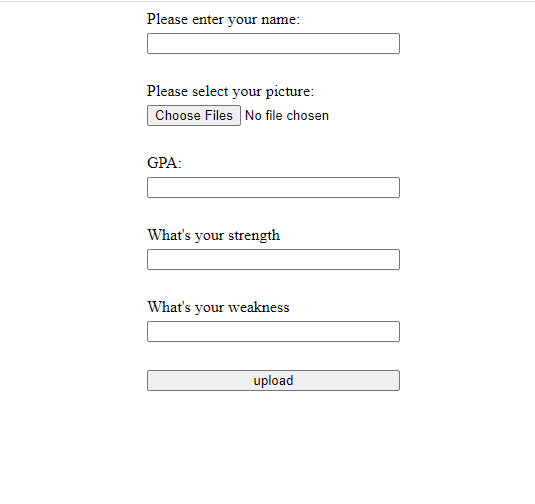
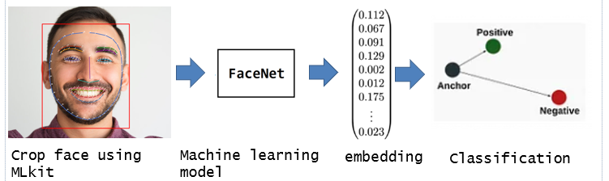
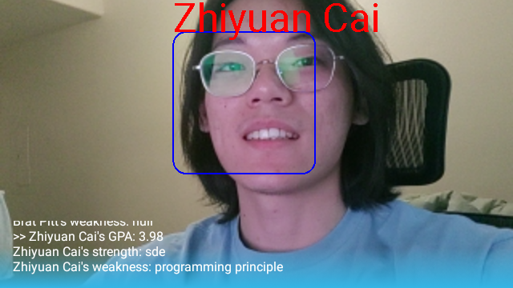

Smart Glass AR project

Introduction:
This project is using MLkit and FaceNet model to do real-time face recognition on Google Glass 2.

How we realize:
1. When the application starts, it will fetch stored face images from firebase and convert them to 128-dimensional embedding.
    There is a website host on firebase for uploading names, images, and other information.

2. Setting up a preview and imageAnalyser using CameraX.
3. Using MLkit to do face detection and crop them from captured video stream frames.
4. Converting cropped face images from a bitmap to ByteBuffer and feeding the it to the FaceNet model.
5. Comparing stored embedding with captured face then pick result with the best score.

6. Once the face is recognized belonging to someone, fetch his/her detailed information from firebase database
7. Output the finally result.

  
