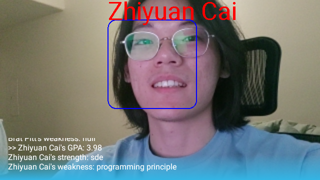

Smart Glass AR project

Introduction:
This project is using MLkit and FaceNet model to do real-time face recognition on Google Glass 2.

How we realize:
1. When the application starts, it will fetch stored face images from firebase and convert them to 128-dimensional embedding.
    There is a website host on firebase for uploading names, images, and other information.

2. Setting up a preview and imageAnalyser using CameraX.
3. Using MLkit to do face detection and crop them from captured video stream frames.
4. Converting cropped face images from a bitmap to ByteBuffer and feeding the it to the FaceNet model.
5. Comparing stored embedding with captured face then pick result with the best score.

6. Once the face is recognized belonging to someone, fetch his/her detailed information from firebase database
7. Output the finally result.

instruction manual:
There are 2 parts of this project, the first one is the website, and the other one is the application deployed on the Google glass.

The websit:
the websit is deployed on Firebase, all its code can be view on website folder. The function of the website is to upload the image users selected and other information such as name, GPA, strength, weakness to the cloud storage. 
The cloud storage is also made up with 2 parts, the firebase storage is charged of storing images, and the firebase database is used for storing personal information. All these data are fetched by students' names. 
There are 2 things need to be pay attention. One thing is students names can be duplicate, eventhough we can use random generate index instead of their names, it was too late for me to change the code, so continuous developers please change this, thank you! The other thing is due to the data transfering limitation, uploaded images should be smaller than 10MB, this 

  
